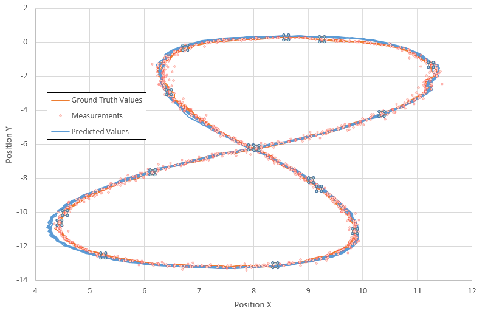
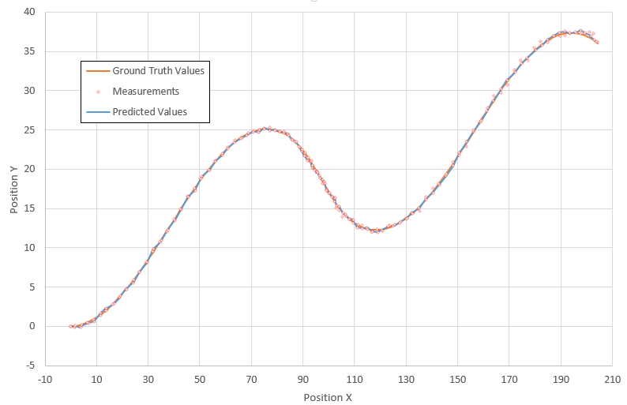

# Extended Kalman Filter Project Starter Code
Self-Driving Car Engineer Nanodegree Program

---

## Dependencies

* cmake >= 3.5
 * All OSes: [click here for installation instructions](https://cmake.org/install/)
* make >= 4.1
  * Linux: make is installed by default on most Linux distros
  * Mac: [install Xcode command line tools to get make](https://developer.apple.com/xcode/features/)
  * Windows: [Click here for installation instructions](http://gnuwin32.sourceforge.net/packages/make.htm)
* gcc/g++ >= 5.4
  * Linux: gcc / g++ is installed by default on most Linux distros
  * Mac: same deal as make - [install Xcode command line tools]((https://developer.apple.com/xcode/features/)
  * Windows: recommend using [MinGW](http://www.mingw.org/)

## Basic Build Instructions

1. Clone this repo.
2. Make a build directory: `mkdir build && cd build`
3. Compile: `cmake .. && make`
4. Run it: `./ExtendedKF path/to/input.txt path/to/output.txt`. You can find
   some sample inputs in 'data/'.
    - eg. `./ExtendedKF ../data/sample-laser-radar-measurement-data-1.txt output.txt`

## Code Style

It has been tried to stick to [Google's C++ style guide](https://google.github.io/styleguide/cppguide.html).

## Results for dataset #1

The following image presents the results obtained on the first data file. The ground truth values of Px and Py along with the predicted values (i.e. using EKF) and the measurement values are shown on the image below. RMSE values of **0.0661335**, **0.0603752**, **0.530256** and **0.54439** were obtained for Px, Py, Px_dot, and Py_dot.

## Results for dataset #2

The following image presents the results obtained on the second data file. The ground truth values of Px and Py along with the predicted values (i.e. using EKF) and the measurement values are shown on the image below. RMSE values of **0.185943**, **0.190263**, **0.477037** and **0.805526** were obtained for Px, Py, Px_dot, and Py_dot.

